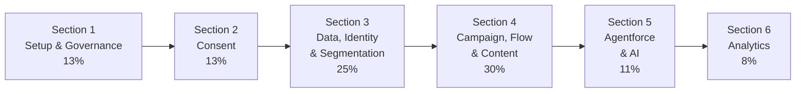

# Exam Section Based Flashcards

> **Purpose:** Active-recall decks organised **by exam section**, weighted to match the real exam blueprint. Use these for targeted drilling of a single section, or work through all six for a full mock-exam sweep.
>
> **Why a separate folder?** The existing `flashcards/` folder is organised **by topic/source**. This folder is organised **by exam section** so you can drill exactly what the exam tests, in exam order and weight.

---

## Exam Blueprint

| # | Section | Weight | Deck |
|---|---------|--------|------|
| 1 | Platform Setup & Governance | 13% | [[section-1-platform-setup-governance]] |
| 2 | Consent | 13% | [[section-2-consent]] |
| 3 | Data Modeling, Identity Resolution & Segmentation | 25% | [[section-3-data-identity-segmentation]] |
| 4 | Campaign Design, Flow Orchestration & Content | 30% | [[section-4-campaign-flow-content]] |
| 5 | Agentforce & AI Innovation | 11% | [[section-5-agentforce-ai]] |
| 6 | Analytics & Performance Insights | 8% | [[section-6-analytics-insights]] |
| — | High-Frequency "Gotcha" Facts (cram) | all | [[gotcha-facts-cram-deck]] |

**Exam facts:** 60 scored questions + up to 5 unscored · 105 minutes · **72%** to pass · Summer '26 release · no prerequisite · no reference materials.

---

## How to Use These Decks

1. **Cover the answer.** Read the **Q**, answer aloud or in writing, *then* reveal the **A**.
2. **Mark your misses.** Anything you get wrong goes on a "revisit" list — re-drill it the next day (spaced repetition).
3. **Weight your time.** Section 4 (30%) + Section 3 (25%) = **55% of the exam**. Spend the most time there.
4. **Drill the ⚠️ cards hardest.** Cards flagged with ⚠️ are the classic exam traps.
5. **Cross-reference.** Each card links back to its `concepts/` page for the full explanation.

---

## Suggested Study Sequence

> **Cramming?** Start with Section 4, then Section 3, then the "Gotcha Facts" deck below.

---

## Related

- [[exam-revision-summary]] — consolidated revision guide by exam weight
- [[study-roadmap]] — full learning tracks & progress dashboard
- `flashcards/` — topic-based decks (deeper dives per source)